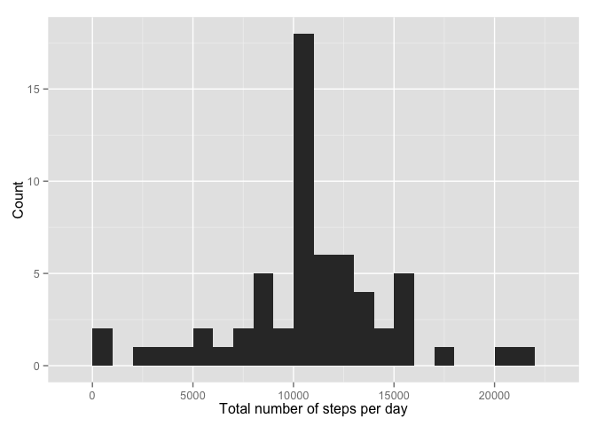
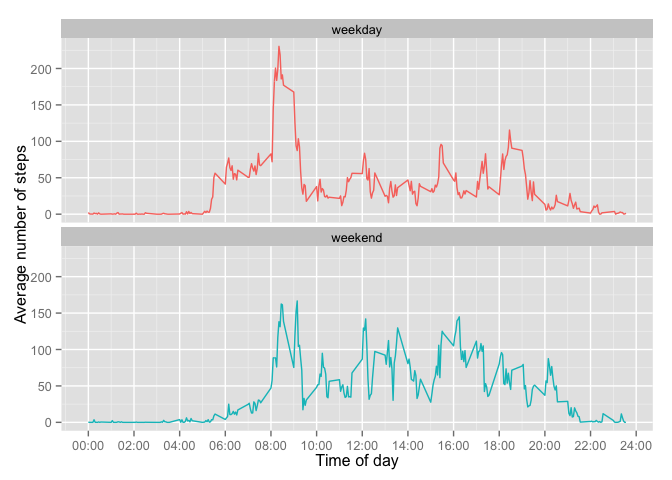

# Reproducible Research: Peer Assessment 1


```r
suppressWarnings(library(knitr))
suppressMessages(suppressWarnings(library(dplyr)))
suppressMessages(suppressWarnings(library(ggplot2)))
opts_chunk$set(echo=TRUE) # echo code by default
```

## Loading and preprocessing the data


```r
activity <- read.csv("activity.csv")
```

## What is mean total number of steps taken per day?

By-date step totals with NA rows omitted:


```r
stepsByDate <- activity %>% na.omit() %>% group_by(date) %>% summarise(steps.sum = sum(steps))
```

Histogram of total number of steps taken each day:


```r
qplot(steps.sum, data=stepsByDate, geom="histogram", binwidth=1000, 
      xlab="Total number of steps per day", ylab="Count")
```

 

Mean and median total number of steps taken per day:


```r
mean(stepsByDate$steps.sum)
```

```
## [1] 10766.19
```

```r
median(stepsByDate$steps.sum)
```

```
## [1] 10765
```

## What is the average daily activity pattern?


By-interval step totals with NA rows omitted:


```r
stepsByInterval <- activity %>% na.omit() %>% group_by(interval) %>% summarise(steps.mean = mean(steps))
```

Time series plot of the 5-minute interval and the average number of steps taken, averaged across all days:


```r
ggplot(data=stepsByInterval, aes(x=interval, y=steps.mean)) +
   scale_x_continuous("Time of day", breaks = seq(0, 2400, 200), 
                      labels = sprintf("%02d:00", seq(0, 24, 2))) + 
  scale_y_continuous("Average number of steps") + geom_line()
```

 

Which 5-minute interval, on average across all the days in the dataset, contains the maximum number of steps?


```r
interval.max <- stepsByInterval[stepsByInterval$steps.mean == max(stepsByInterval$steps.mean), ]
interval.max$time <- sprintf("%02d:%02d", 
                             as.integer(interval.max$interval / 100), 
                             as.integer(interval.max$interval) %% 100)
subset(interval.max, select=c(time, steps.mean))
```

```
## Source: local data frame [1 x 2]
## 
##    time steps.mean
## 1 08:35   206.1698
```

## Imputing missing values

The total number of missing values in the original dataset:


```r
nrow(activity)
```

```
## [1] 17568
```

```r
sum(is.na(activity))
```

```
## [1] 2304
```

To fill in missing data, we will use the average number of steps of each time interval.


```r
# use stepsByInterval from above
activity <- activity %>% group_by(interval) %>% 
            mutate(steps.imputed=ifelse(is.na(steps), mean(steps, na.rm=TRUE), steps))
```

Histogram of total number of steps taken each day in the imputed data:


```r
stepsByDate.imputed <- activity %>% group_by(date) %>% 
      summarise(steps.sum = sum(steps), steps.imputed.sum = sum(steps.imputed))
qplot(steps.imputed.sum, data=stepsByDate.imputed, geom="histogram", 
      binwidth=1000, xlab="Total number of steps per day", ylab="Count")
```

 

Mean and median total number of steps taken per day in the imputed data:


```r
mean(stepsByDate.imputed$steps.imputed.sum)
```

```
## [1] 10766.19
```

```r
median(stepsByDate.imputed$steps.imputed.sum)
```

```
## [1] 10766.19
```

Recall these values from the original data:


```r
mean(stepsByDate$steps.sum)
```

```
## [1] 10766.19
```

```r
median(stepsByDate$steps.sum)
```

```
## [1] 10765
```

By replacing the missing values with means from the respective time intervals, we have not changed the mean since more data points of the mean value won't change the mean for any data set (straightforward to prove mathematically).  

For the median, however, we have replaced over 10% (see number of NA rows out of total above) of the values in this data set with the original mean, which causes the median to match the mean for this data set.  In general, adding more data points of the mean value to a data set will move the median closer to the mean (and for this set it moves the median to the mean).

In this data set, the step counts are either all missing or all present for each day.  This is shown by observing that the count of NA values per day are either zero or 288 (the number of 5-minute intervals in a day).


```r
activity %>% group_by(date) %>% 
  summarise(na.count = sum(is.na(steps))) %>% group_by(na.count)
```

```
## Source: local data frame [61 x 2]
## Groups: na.count
## 
##          date na.count
## 1  2012-10-01      288
## 2  2012-10-02        0
## 3  2012-10-03        0
## 4  2012-10-04        0
## 5  2012-10-05        0
## 6  2012-10-06        0
## 7  2012-10-07        0
## 8  2012-10-08      288
## 9  2012-10-09        0
## 10 2012-10-10        0
## ..        ...      ...
```

The first rows of this summary have NA counts of 0 or 288, and this holds for the entire summary:


```r
colSums(table(activity %>% group_by(date) %>% 
                summarise(na.count = sum(is.na(steps))) %>% 
                group_by(na.count)))
```

```
##   0 288 
##  53   8
```

Therefore the estimates for the number of steps has not changed for days that had data, and has been replaced with the per-interval average for days that had no data.we

## Are there differences in activity patterns between weekdays and weekends?

Create a new factor variable in the dataset with two levels -- "weekday" and "weekend" indicating whether a given date is a weekday or weekend day.


```r
activity$weekday <- weekdays(as.POSIXct(activity$date))
activity <- activity %>% 
  mutate(daytype = ifelse(weekday == "Sunday" | weekday == "Saturday", "weekend", "weekday"))
activity[sample(1:nrow(activity), 10), ]
```

```
## Source: local data frame [10 x 6]
## Groups: interval
## 
##    steps       date interval steps.imputed   weekday daytype
## 1      0 2012-10-27     1720             0  Saturday weekend
## 2     34 2012-11-07     1035            34 Wednesday weekday
## 3     94 2012-11-02     1450            94    Friday weekday
## 4      0 2012-10-26       25             0    Friday weekday
## 5      7 2012-11-12     1735             7    Monday weekday
## 6      0 2012-10-04      420             0  Thursday weekday
## 7      7 2012-11-16     1635             7    Friday weekday
## 8      0 2012-11-17     1045             0  Saturday weekend
## 9      0 2012-10-23      645             0   Tuesday weekday
## 10     0 2012-10-25     1645             0  Thursday weekday
```

A plot of the 5-minute interval and the average number of steps taken, averaged across all weekday days or weekend days:


```r
qplot(interval, steps.imputed, data=activity, geom="line", color=daytype, 
      stat="summary", fun.y="mean") + 
  facet_wrap( ~ daytype, nrow=2) + 
  scale_x_continuous("Time of day", breaks = seq(0, 2400, 200), 
                     labels = sprintf("%02d:00", seq(0, 24, 2))) + 
  scale_y_continuous("Average number of steps") + 
  theme(legend.position = "none")
```

 
